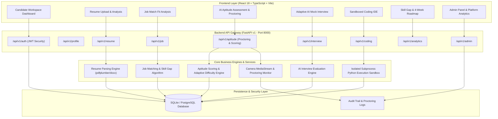

# IntervueX - Adaptive AI Interview & Career Readiness Platform

> **Tagline:** *"Practice Smarter. Interview Better. Get Career Ready."*

IntervueX is a full-stack, enterprise-grade AI interview simulation, aptitude assessment, and career readiness platform for students, job seekers, and freshers. It analyzes candidate profiles, uploaded resumes (PDF/DOCX), target job descriptions, and proctored MNC aptitude tests to deliver dynamic adaptive interviews, compute multi-dimensional readiness scores, identify skill gaps, and generate personalized 4-week preparation roadmaps.

---

## 📐 System Architecture Diagram



---

## 🚀 Key Modules & Architecture Breakdown

### 1. AI-Powered Aptitude Assessment & Proctoring Module
- **MNC-Style Practice Assessment**: 40 questions over 45 minutes spanning Quantitative Aptitude, Logical Reasoning, Verbal Ability, Data Interpretation, and Analytical Reasoning.
- **Company-Style Preparation Patterns**: TCS-style, Infosys-style, Wipro-style, Cognizant-style, Capgemini-style, Accenture-style, Tech Mahindra-style, LTIMindtree-style, Persistent-style.
- **Camera & System Security Check**: Explicit MediaDevices camera permission check, live stream preview, privacy consent agreement, browser & server timer synchronization.
- **Anti-Cheating Monitoring Engine**: Captures tab-switch, window blur, and camera disconnection events with incident threshold tracking.
- **Backend Scoring & Results**: Server-validated countdown timer, negative marking (+1.0 / -0.25), section breakdown, accuracy, strength & weakness detection, step-by-step question review, and topic recommendations.

### 2. Candidate Profile & Resume Parsing
- Upload PDF or DOCX resumes with automated text extraction.
- Structured profile parsing across 6 core categories (Technical Skills, Projects, Experience, Education, Keywords, Completeness).

### 3. Job Description Analysis & Resume Matching
- Paste target job descriptions to extract required skills, preferred qualifications, and keywords.
- Calculates Job Match Fit Score (%) alongside matched, partial, and missing skills.

### 4. Adaptive AI Interview Engine
- Grounded non-chatbot question generator driven by candidate resume context, target role skills, and project defense.
- Real-time adaptive follow-up logic based on answer quality.

### 5. Sandboxed Coding IDE & Voice Integration
- Subprocess-isolated Python code execution sandbox with strict execution timeouts and memory limits.
- Speech-to-Text integration using browser Web Speech API with seamless text fallback.

### 6. Skill Gap Analysis & 4-Week Roadmap
- Identifies weak technical areas automatically from interview performance and test results.
- Generates interactive 4-week preparation task roadmaps.

### 7. Admin Platform Dashboard & Security Audit
- Global platform analytics, candidate account management, and real-time audit logs.

---

## 🛠️ Technology Stack

- **Backend**: Python 3.10+, FastAPI, SQLAlchemy 2.0 ORM, Pydantic v2, PyJWT, Passlib (bcrypt).
- **Frontend**: React 18, TypeScript, Vite, Vanilla Enterprise SaaS CSS, Lucide Icons.
- **Database**: PostgreSQL (Production) / SQLite (Zero-config Development).
- **AI Service**: Abstracted Provider Layer (Google Gemini / OpenAI / Smart Evaluation Engine).
- **Security & Sandbox**: MediaDevices Proctoring, Subprocess Execution Sandbox.
- **Deployment**: Docker & Docker Compose.

---

## 💻 Getting Started Locally

### Prerequisites
- Python 3.10+
- Node.js 18+ (for frontend development)

### 1. Backend Setup

```bash
cd backend
py -3 -m pip install -r requirements.txt
py -3 -m pytest tests/ -v
py -3 -m uvicorn app.main:app --reload --port 8000
```
Backend API runs at `http://127.0.0.1:8000` with interactive Swagger documentation at `http://127.0.0.1:8000/docs`.

### 2. Frontend Setup

```bash
cd frontend
npm install
npm run dev
```
Frontend UI runs at `http://localhost:5173`.

---

## 🐳 Running with Docker Compose

```bash
docker-compose up --build
```

---

## 🧪 Testing Suite

Run full backend unit and integration test suite:

```bash
cd backend
py -3 -m pytest tests/ -v
```

---

## 📜 License & Project Status

Enterprise Production-Style SaaS Platform. Fully functional end-to-end.
